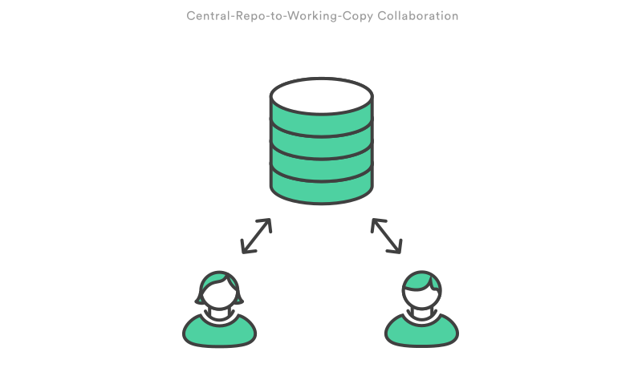

#  git

## O que é git?
Git é um sistema de controle de versões.

   

 

## Instalação recomendada
Para trabalhar com git e mantermos um padrão de desenvolvimento dentro da Info Jr., vamos utilizar o **git bash** no qual manipularemos via CLI (command line interface).

**Linux/Unix**: https://git-scm.com/download/linux

**Windows**: https://git-scm.com/download/win

**Mac OS X**: https://git-scm.com/download/mac

 

## Como usamos dentro da empresa?

Utilizamos a metodologia *central-repo-to-working-copy collaboration*.

Cada membro da equipe possui uma cópia local em que desenvolve sua parte do projeto e assim que finalizar, executa um *push* para o repositório central que contém o projeto completo, localizado em https://github.com/InfoJr/{projeto}

   

## Mas o que é *push*?
Essa palavra foi mencionada na explicação anterior. O que seria isto?  
*push* é uma palavra reservada do git para executar o upload de um repositório para outro.

### **Veja mais em nosso [*workflow*](pages/workflow.md)!**
