#  Workflow


<br/>
## Conteúdo
1. [Repositórios](#repositórios)<br/>
	- [Definição](#definição)<br/>
    - [Ciclo de projeto](#ciclo-de-projeto)<br/>
    - [Setup inicial](#setup-inicial)<br/>
        - [Fork](#fork)<br/>
        - [git clone](#git-clone)<br/>
        - [Definir repositórios remotos em sua máquina](#definir-repositórios-remotos-em-sua-máquina)<br/>
    - [Branches](#branches)<br/>
2. [Desenvolvendo](#desenvolvendo)<br/>
    - [Fluxo](#fluxo)
    - [git status](#git-status)<br/>
    - [git commit](#git-commit)<br/>
    - [git push](#git-push)<br/>
    - [git pull](#git-pull)<br/>
    - [pull request](#pull-request)<br/>

## Repositórios

### Definição
Repositórios são pastas que possuem gerenciamento de versão através do git, ou seja, diretórios com git inicializado.

### Ciclo de projeto
<p align="center">
   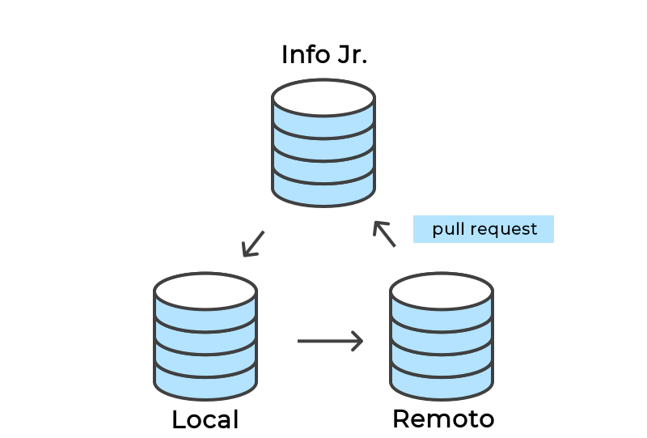
</p>


<p align="center">
    O fluxo do código nos repositórios é o mesmo em todo projeto.
</p>

- Primeiramente, os arquivos alterados são transferidos da máquina local do desenvolvedor(a) ao seu repositório remoto pelo comando [git push](#git-push). (seu repositório remoto fica localizado em https://github.com/{username}/{projeto})
- Após isso, o desenvolvedor precisa criar um [pull request](#pull-request), referenciando **infojr/{projeto} branch ⬅ username/{projeto} branch**, como exibido na imagem abaixo, para que a alteração existente em seu repositório remoto seja transferida também ao repositório central de forma com que todos os membros consigam baixar a atualização em seus repositórios locais.

<p align="center">
   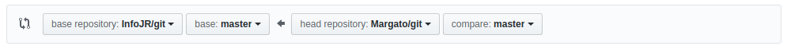
</p>

- Com o repositório central atualizado, qualquer membro pode baixar as atualizações com o comando [git pull](#git-pull) e continuar o desenvolvimento do projeto e dando início a esse ciclo novamente.

**Observação**: Nunca envie sua atualização diretamente ao repositório central sem passar pelo remoto, o ciclo é essencial para revisões e possíveis reversões.


### Setup inicial
No início de cada projeto, é trivial seguir os seguintes itens:

---

#### Fork
Fork é a criação de um repositório cópia remoto a partir do central. Pode ser dado clicando no botão **Fork** como demonstrado na imagem abaixo:

<p align="center">
   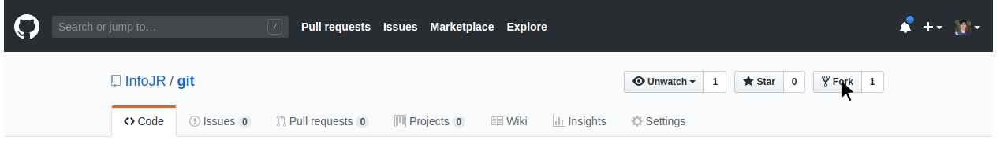
</p>

---

#### git clone
Esse comando serve para clonar o repositório remoto para sua máquina.
```bash
$ git clone https://github.com/infojr/{projeto}
```
**Dica**: Se atente a executar esse comando no diretório onde está localizado o *htdocs*.

---

#### Definir repositórios remotos em sua máquina
Após executar a clonagem do repositório, você agora possui um repositório local, porém, ele ainda não está configurado para reconhecer qual é o repositório central e qual o remoto.

```bash
$ git remote set-url origin https://github.com/{username}/{projeto}
$ git remote add upstream https://github.com/infojr/{projeto}
```

**upstream** é o nome dado ao repositório central.

Caso tenha feito tudo certo, ao dar o comando **git remote -v**, o retorno do terminal deve estar semelhante à imagem abaixo:


<p align="center">
   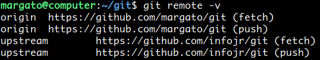
</p>

---

### Branches
Uma branch é uma ramificação no projeto para que uma nova funcionalidade seja implementada ou testada sem que o código-fonte principal e/ou o desenvolvimento dos demais desenvolvedores seja comprometido.
Para projetos robustos, tais como [SMA](https://github.com/infojr/projeto-sma) ou [iCampus](https://github.com/infojr/icampus), a utilização de branches é essencial.
<p align="center">
   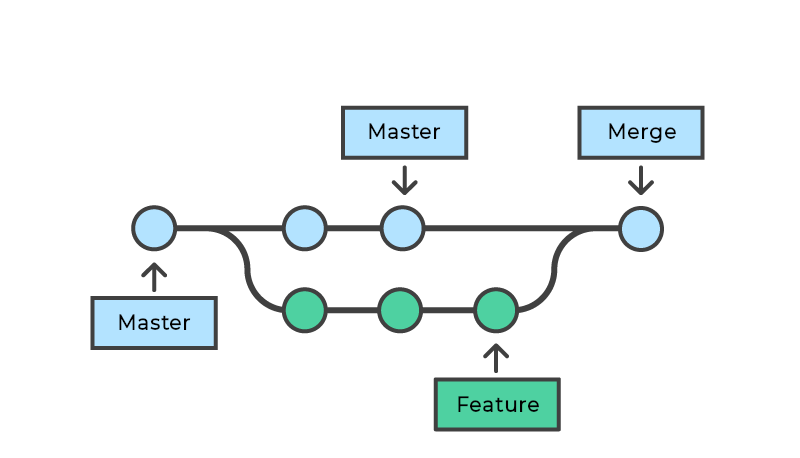
</p>
<p align="center">
   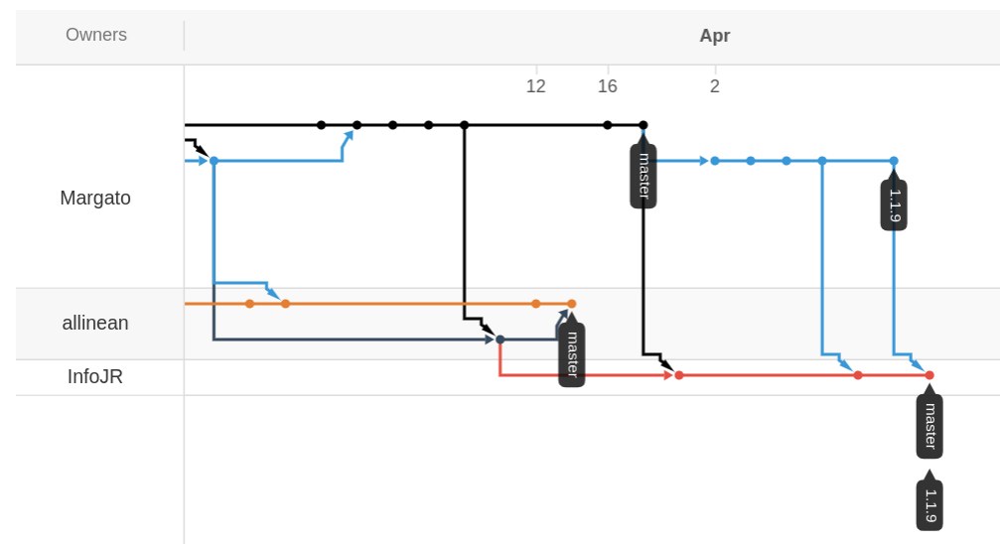
</p>


<p align="center">
    Análise da ramificação do <a href="https://github.com/infojr/icampus/network">iCampus</a> 
</p>

#### Comandos
Para checar em que branch seu projeto se encontra, execute:
```bash
$ git branch
```
<br/>

---
Para criar uma nova branch em sua máquina, digite:
```bash
$ git checkout nome-da-branch
```
Após isso, todos os arquivos do seu computador serão alterados para os presentes na branch em questão automaticamente.

**Dica**: Atente-se a qual branch você está trabalhando. (central ou local) 

# Desenvolvendo
Após, o [setup inicial](#setup-inicial) e entender mais sobre o que são [repositórios](#repositórios) e como se comportam, agora vamos ver como enviar e baixar as atualizações do projeto.

## Fluxo
O fluxo de desenvolvimento se resume basicamente em:
- Sempre ao executar [git commit](#git-commit):
    - Puxar atualizações. ([git pull](#git-pull))
    - Verificar mensagem de retorno no terminal.
    - Se o git acusar conflito:
        - Resolver conflito <br/>**Dica**: Observe as linhas em que o git acusa conflito ou através da comparação feita pelo Visual Studio Code.
    - Executar [git push](#git-push).

## git status
Esse comando nos informa quais arquivos foram alterados.

```bash
$ git status
```
<p align="center">
   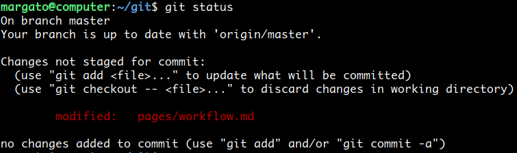
</p>
Neste projeto, por exemplo, o arquivo <i>workflow.md</i> está diferente ao comparar o repositório remoto na branch master (origin/master).
<br/>
Para que seja possível enviarmos ao repositório remoto, precisamos rastrear o arquivo pelo git, utilizando o comando:

```bash
$ git add pages/workflow.md
```

Esse comando fará com que o git adicione esse arquivo para a lista de arquivos alterados nesse futuro [commit](#git-commit) que iremos fazer.
<br/>
Ao executar o comando **git add**, é possível ver que agora o git já reconhece o arquivo como pronto para ser comentado.
<p align="center">
   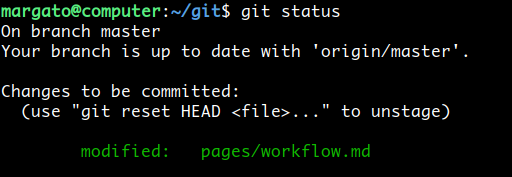
</p>

**Dica**: É possível executar o comando **git add .** para adicionar todos os arquivos modificados como prontos a serem comentados. Para remover arquivos do estágio, é possível executar **git reset {arquivo}** ou **git reset .**

## git commit
Devemos comentar todos os arquivos adicionados utilizando [git add](#git-status) de modo claro e objetivo para que todos os membros da equipe saibam do que a alteração em questão se trata.

```bash
$ git commit -m "Alteração do estilo do rodapé"
```

## git pull
Para puxarmos as atualizações do repositório central ao nosso local, executamos o seguinte comando:
```bash
$ git pull {nome do repositório remoto} {branch local}
```
Caso tenha feito tudo conforme essa [seção](#definir-repositórios-remotos-em-sua-máquina), execute:

```bash
$ git pull upstream master 
```

## git push
Após comentarmos nossa atualização, devemos enviar nossas atualizações para o repositório remoto. Utilizamos:

```bash
$ git push 
```

**Importante**: Antes de executar esse comando, verifique se algum outro colega enviou uma alteração utilizando [git pull](#git-pull)

---

### **Não é possível executar git push ou git pull com arquivos sem commit**

---

## Pull request
Um pull request é uma solicitação de alteração no repositório central.
<br/>
Após executar o [git push](#git-push), é necessário criar um pull request para que seu código seja mesclado com o principal.

<p align="center">
   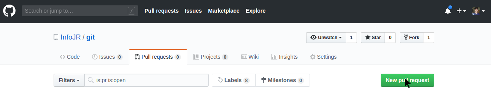
</p>

Como descrito na seção [ciclo de projeto](#ciclo-de-projeto), você deve referenciar o repositório e a branch para comparação e assim, criar o pull request.


<p align="center">
   
</p>

Novamente, coloque um título claro e objetivo e adicione uma descrição caso necessário.
<br/>
**Falta pouco!** Agora você só precisa clicar em **Merge pull request** para que seu código seja mesclado com o repositório central.
<p align="center">
   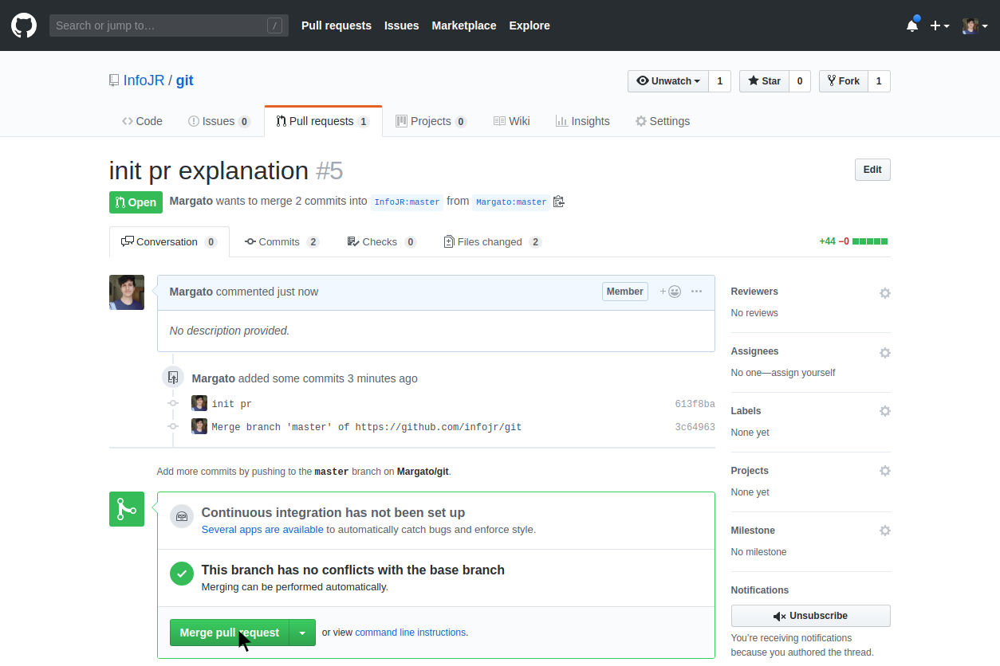
</p>

E...


<p align="center">
   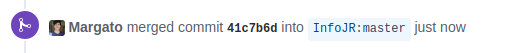
</p>

Mesclado!


---

# Dúvidas?
Git não é uma ferramenta fácil de aprender, possui uma curva de aprendizado grande. Não tenha vergonha de perguntar!<br/>
Nesse tutorial estão apenas algumas funcionalidades essenciais do git, você pode conferir toda a documentação [aqui](https://git-scm.com/docs).
